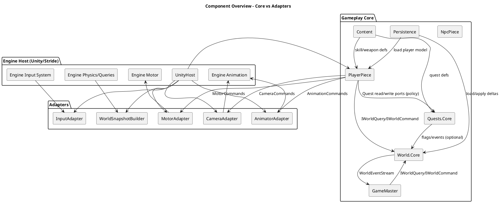
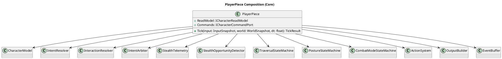
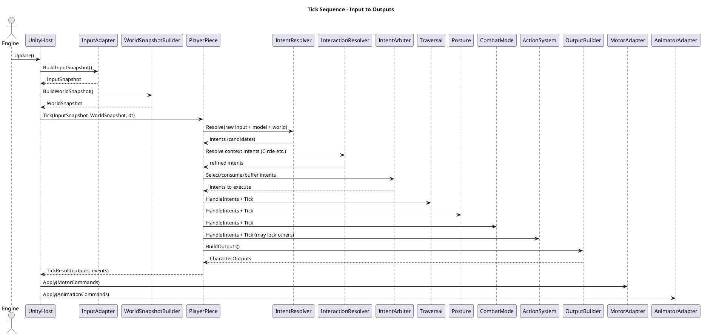
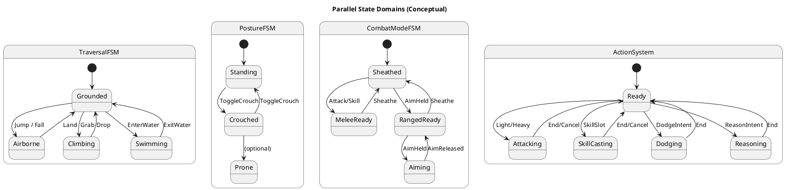
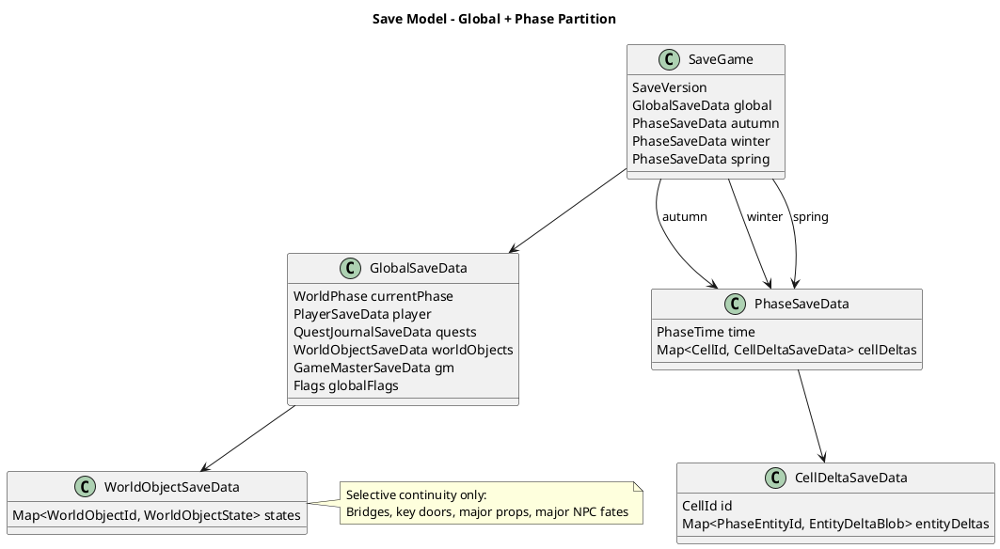
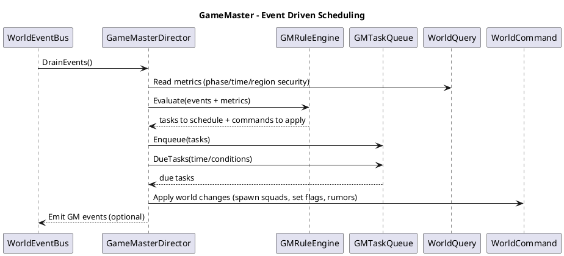

# Game Architecture Design Document

## 1. Scope

This document describes a modular, engine-portable architecture for a character-driven action RPG with:
- Multi-domain character control (Traversal/Posture/CombatMode/Action)
- Input → Intent resolution + arbitration
- Stealth, interaction opportunities, and social actions (“Reason”) during combat
- Phase-based world variants (Autumn/Winter/Spring) with per-phase deltas and selective cross-phase `WorldObjectId` continuity
- A reactive world director (“GameMaster”) that schedules events outside direct player control
- Persistence designed to scale (JSON first; SQLite/chunked later)

The architecture is designed to:
- Avoid state explosion
- Avoid mixed concerns (Unity-specific code stays in adapters)
- Make the Player and NPCs “chess pieces” with stable outward APIs

---

## 2. Design Principles

### 2.1 Hard boundaries
- Core gameplay modules **must not** depend on engine/runtime APIs (Unity/Stride).
- Engine host layers convert between engine objects and **pure snapshots/outputs**.

### 2.2 Durable vs transient
- Save only durable model state (stats, quests, equipment, reputation, world deltas).
- Do not persist transient runtime state (FSM instances, animation progress, input buffers) unless explicitly required.

### 2.3 Ownership
Each domain owns a small set of decisions and state variables:
- Traversal: grounded/airborne/swim/climb semantics
- Posture: stance + collider profile + baseline stealth multipliers
- CombatMode: sheathed/unsheathed, ranged vs melee readiness, aiming mode
- Action: committed action execution, stamina costs, cooldowns, buffering, cancel windows

### 2.4 Input resolution is separate
Unity Input System handles *physical mapping* and interactions (tap/hold/chords).
Game logic resolves *meaning in context* and arbitrates conflicts.

---

## 3. Repository / Solution Layout
```

/docs
Architecture.md
PlayerArchitecture.md
Persistence.md
WorldPhases.md
GameMaster.md

/src
Game.SharedKernel
Game.Content
Game.World.Core
Game.Characters.Core
Game.Quests.Core
Game.GameMaster.Core
Game.Persistence.Core
Game.Persistence.Json
Game.Adapter.Unity
Game.UnityHost
/tests
Game.Characters.Core.Tests
Game.World.Core.Tests
Game.GameMaster.Core.Tests
Game.Persistence.Core.Tests

```
---

## 4. Core Module Boundaries

### 4.1 Game.SharedKernel
- IDs: `EntityId`, `FactionId`, `QuestId`, `SkillId`, `WorldObjectId`, `CellId`
- Math primitives: `Vec2`, `Vec3`, `Angle`
- Messaging primitives: `DomainEvent`, `IEventBus`

### 4.2 Game.Content
Static definitions (data-driven):
- `SkillDefinition`, `WeaponDefinition`, `QuestDefinition`
- Phase world catalogs (which content belongs to Autumn/Winter/Spring)

### 4.3 Game.World.Core
- `WorldPhase`, `WorldClock`
- World partitioning (cells/chunks), streaming policy
- Read/write ports: `IWorldQuery`, `IWorldCommand`
- Deltas: per-phase, per-cell
- `WorldObjectState` for selective cross-phase continuity
- World events bus

### 4.4 Game.Characters.Core
- `CharacterPieceBase`, `PlayerPiece`, `NpcPiece`
- Durable `CharacterModel`: stats, reputation, equipment, skill loadouts
- Input snapshot → Intent resolution → arbitration
- Domains: Traversal/Posture/CombatMode/Action
- Systems: stealth telemetry + opportunities, interaction resolver, social attempt hooks
- Output commands + events

### 4.5 Game.Quests.Core
- `QuestJournal` and quest instance states
- Phase gating, expiry rules, phase transition policies
- Quest events

### 4.6 Game.GameMaster.Core
- Reactive world director
- Rules, task scheduling, condition triggers
- Persists its own agenda and world metrics

### 4.7 Game.Persistence.Core (+ Json)
- Save models: global + per-phase cell deltas + worldobject state + player + quests + GM state
- Versioning + migrations
- Storage port `ISaveStore`, serializer port `ISaveSerializer`

### 4.8 Adapters / Hosts
- Unity adapters build snapshots and apply outputs
- Unity host composes systems and wires DI

---

## 5. The Chess Piece Concept

A “piece” (player/NPC/monster) is a unit with:
- A stable **read model** interface for the rest of the world
- A narrow **command port** for effects applied to it (damage/status/impulses/social offers)
- An event stream emitted outward
- Internal modules that are private (no external access)

### 5.1 Outward API contracts

- `ICharacterReadModel`:
  - identity + faction
  - kinematics: position/forward/velocity
  - modes: traversal, posture, combat mode, aiming
  - action: locked/current action tag
  - stealth: noise/visibility emission
  - resources: health/stamina

- `ICharacterCommandPort`:
  - ApplyDamage / ApplyImpulse / ApplyStatus
  - ReceiveInteractionOffer (optional)

---

## 6. Diagrams

### 6.1 Component overview




------

### 6.2 PlayerPiece internal composition




------

### 6.3 Frame update sequence (input → intent → domains → outputs)




------

### 6.4 Multi-domain state model (conceptual)

This is not a strict UML state chart (because each domain is separate), but it shows the parallel state concept.

.png)



------

### 6.5 Persistence partitioning by phase with selective WorldObjectId




------

### 6.6 GameMaster director loop




------

## 7. Responsibility Matrix (non-negotiable)

| Concern                                                      | Owner                                     |
| ------------------------------------------------------------ | ----------------------------------------- |
| Grounded/Airborne/Swimming/Climbing semantics                | TraversalFSM                              |
| Stance/collider profile, baseline noise multiplier           | PostureFSM                                |
| Sheathed/MeleeReady/RangedReady, Aiming mode                 | CombatModeFSM                             |
| Attacks/skills/dodge/social actions, stamina, buffering, cancels | ActionSystem                              |
| Noise/visibility continuous emission                         | StealthTelemetry                          |
| Interaction opportunity detection (pickpocket, takedown, lockpick, reason) | OpportunityDetector + InteractionResolver |
| Raw input device mapping/chords                              | Engine Input System + InputAdapter        |
| Contextual meaning of input                                  | IntentResolver + InteractionResolver      |
| World phase baseline content                                 | Content + World loader                    |
| Per-phase local deltas                                       | World.Core + Persistence                  |
| Cross-phase continuity objects                               | WorldObjectState (Global)                 |
| Macro reactive world                                         | GameMasterDirector                        |

------

## 8. Key Data Types (silhouettes)

### 8.1 InputSnapshot

- `Move: Vec2`, `Look: Vec2`
- Buttons as `ButtonState`:
  - `Primary`, `Secondary`, `Tertiary`, `Jump`
  - `AimModifier`, `SkillModifier`
  - `ContextGrabOrFire`
  - plus toggles as needed

### 8.2 WorldSnapshot

- Contact and environment features:
  - `IsGrounded`, `IsInWater`, `CanClimb`, `CanMantle`, `SurfaceTag`
- Nearby interactables summary:
  - best candidate door, NPC, loot, etc.
- Optional: Threat/social context summary

### 8.3 Intent types

- traversal intents: `JumpIntent`, `GrabOrClimbIntent`, `MantleIntent`
- combat intents: `LightAttackIntent`, `HeavyAttackIntent`
- skill intents: `UseSkillIntent(slot, kind)`
- ranged intents: `FireBasicRangedIntent`
- interaction intents: `LockpickIntent`, `PickpocketIntent`, `TalkIntent`, `ReasonIntent(targetId)`

### 8.4 Outputs

- `MotorCommands`: move intent, speed cap, root motion enable, align-to-target
- `AnimationCommands`: param changes, triggers, action tags
- `CameraCommands`: aim camera, lock-on suggestions
- `SfxVfxCommands`: footsteps, impact, stealth whoosh, etc.

------

## 9. Save/Load Policies

### 9.1 Saved

- Player: stats, equipment, skill loadouts, reputation, resources (configurable)
- Quests: journal and objective progress
- World: current phase + per-phase cell deltas + global WorldObject states
- GameMaster: scheduled tasks + metrics + cooldowns

### 9.2 Not saved (recomputed)

- FSM current state instances
- animation graph runtime
- cached physics queries
- input buffers (unless explicit design requires)
- transient “in combat” flags

### 9.3 Phase transitions

When phase changes:

- Flush current phase deltas
- Update global phase state
- Run quest transition policies (expire/convert)
- Load phase baseline world + apply phase deltas
- Apply global WorldObjectState

------

## 10. Implementation Roadmap (incremental)

### Milestone 1 (clean seam)

- Introduce `InputSnapshot`, `IntentResolver`, and `Tick` pipeline
- Convert existing locomotion FSM to consume intents rather than input events
- Output commands instead of direct Animator/CharacterController calls (adapter applies)

### Milestone 2 (combat/action)

- Add CombatMode model (aim + weapon readiness)
- Add ActionSystem for light/heavy/skill/dodge
- Add InteractionResolver for Circle basics

### Milestone 3 (stealth/posture/social)

- PostureFSM + StealthTelemetry
- Opportunity detection for takedown/pickpocket/lockpick
- Add `ReasonAction` as a first social action

### Milestone 4 (world phases + persistence)

- Implement phase baseline world loading
- Implement per-phase deltas + WorldObjectId global state
- JSON save system with versioning

### Milestone 5 (GameMaster)

- Event bus integration
- GM task scheduling and 2–3 reactive rules
- GM persistence

------

## 11. Invariants & Guardrails

1. Core modules must compile without engine references.
2. No system other than the domain owner mutates that domain’s state.
3. All contextual input meaning is resolved before domain modules.
4. External systems interact with pieces only via `ICharacterReadModel` and `ICharacterCommandPort`.
5. Per-phase deltas never apply outside their phase.
6. Only selective objects receive cross-phase `WorldObjectId`.