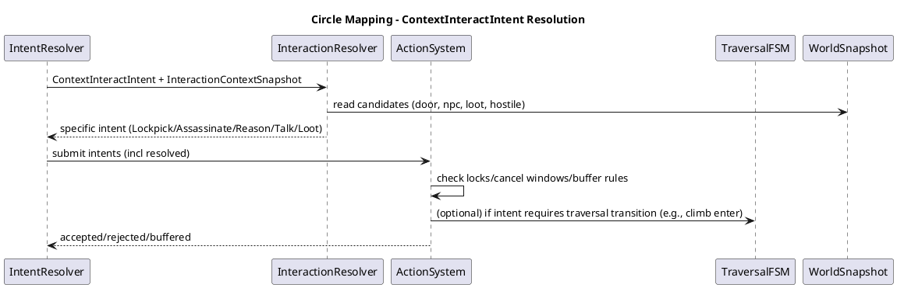
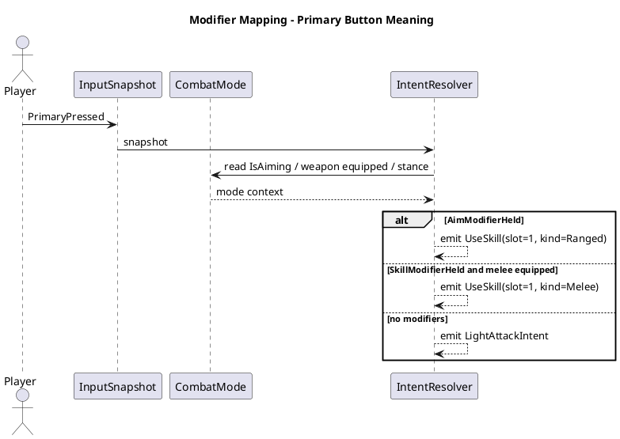

# PlayerArchitecture

## 1. Purpose

This document specifies the **player-specific** architecture built on the core character framework, focusing on:
- Input → Intent resolution (including multi-button modifiers)
- Intent arbitration (priority/consumption/buffering)
- Parallel domains (Traversal/Posture/CombatMode/Action) and their responsibilities
- Interaction pipeline (the “Circle button problem”)
- Stealth + social actions (Reason/Bribe/Threaten) as first-class actions
- Cancel windows and buffering policy (high-level rules, not implementation)

This is intended to prevent state explosion and mixed concerns as scope expands (Dogma-style melee + Ratchet-like shooting + stealth + climbing/swimming + contextual interaction).

---

## 2. Player Control Pipeline Overview

### 2.1 The control pipeline (conceptual)

1) **Raw Inputs** (engine bindings)
2) **InputSnapshot** (per-frame action states)
3) **IntentResolver** (context-independent mapping: actions/modifiers → candidate intents)
4) **InteractionResolver** (context-dependent mapping for “ContextInteract”)
5) **IntentArbiter** (priority + consumption + buffering)
6) **Domains update** (Traversal, Posture, CombatMode, Action)
7) **Outputs + Events** (motor/anim/camera/sfx + gameplay events)

### 2.2 Why the pipeline exists
- Unity Input System answers: *what physical actions occurred?*
- The pipeline answers: *what should the character do, given context and constraints?*

---

## 3. Core Concepts

### 3.1 InputSnapshot (raw action states)
The InputSnapshot contains **bound actions**, not physical device names:
- Movement: `Move`, `Look`
- Face actions: `Primary`, `Secondary`, `Tertiary`, `Jump`
- Modifiers: `SkillModifier` (R1), `AimModifier` (L1)
- Context: `ContextGrabOrFire` (R2), `ContextInteract` (Circle if not used as tertiary)
- Optional: `LockOn`, `SheatheToggle`, `Menu`, etc.

Each action is represented as `ButtonState`:
- `PressedThisFrame`
- `Held`
- `ReleasedThisFrame`

### 3.2 Candidate Intent
An intent is **game meaning**, not device meaning:
- `LightAttackIntent`
- `UseSkillIntent(slot, kind=Melee|Ranged)`
- `JumpIntent`, `DodgeIntent`
- `GrabOrClimbIntent`, `MantleIntent`
- `FireBasicRangedIntent`
- `ContextInteractIntent` (pre-resolution)
- `ReasonIntent(targetId)` (post-resolution)
- etc.

### 3.3 WorldSnapshot & InteractionContextSnapshot
- `WorldSnapshot`: locomotion/environment facts (grounded, water, climbable, mantle)
- `InteractionContextSnapshot`: best interaction candidates (door, NPC, loot), plus stealth/social opportunities.

---

## 4. Parallel Domains

The player is always in multiple “states” concurrently. These are managed by **separate domains**.

### 4.1 Traversal Domain (TraversalFSM)
**Responsibility**
- Movement mode semantics:
  - `Grounded`, `Airborne`, `Swimming`, `Climbing`, `LedgeHang` (optional)
- Owns transitions driven by environment + movement intents:
  - Jump, land, enter water, grab ledge, start climb

**Consumes intents**
- `JumpIntent` (if applicable)
- `GrabOrClimbIntent` / `MantleIntent`
- Environment transition intents (if any)

**Does not own**
- Attacks/skills/social actions
- Equipment/aiming logic
- Quest interactions

### 4.2 Posture Domain (PostureFSM)
**Responsibility**
- Stance/collider profile:
  - `Standing`, `Crouched`, `Prone` (optional)
- Baseline stealth multipliers:
  - noise multiplier, visibility multiplier
- Movement caps related to posture (not full traversal)

**Consumes intents**
- `ToggleCrouchIntent` (or `PostureChangeIntent`)

**Does not own**
- Stealth takedown decision
- Interaction selection

### 4.3 Combat Mode Domain (CombatModeFSM)
**Responsibility**
- Weapon readiness and aiming mode:
  - `Sheathed`, `MeleeReady`, `RangedReady`, `Aiming` (or `IsAiming` flag)
- Controls which action set is active:
  - melee default attacks vs ranged default fire
  - skill slot type selection (melee vs ranged)

**Consumes intents**
- `AimStart/Stop` (or derives from `AimModifier`)
- `SheatheToggleIntent` (optional)
- `RequestUnsheatheIntent` (from ActionSystem)

**Does not own**
- Executing attacks/skills (ActionSystem owns)
- Traversal transitions

### 4.4 Action Domain (ActionSystem)
**Responsibility**
- Committed actions (attacks, dodge, skills, interact actions, social actions)
- Stamina costs, cooldowns, buffering, cancel windows
- Outputs movement/animation constraints while action runs

**Consumes intents**
- `LightAttackIntent`, `HeavyAttackIntent`
- `UseSkillIntent(...)`
- `DodgeIntent`
- `InteractIntent`, `LockpickIntent`, `PickpocketIntent`, `AssassinateIntent`, `KnockoutIntent`
- `ReasonIntent(targetId)` and other social intents

**Does not own**
- Physical grounded/swimming/climbing semantics
- Baseline posture selection

---

## 5. Input → Intent Mapping (Dogma-inspired scheme)

### 5.1 Baseline (no modifiers)
- `Primary` → `LightAttackIntent`
- `Secondary` → `HeavyAttackIntent`
- `Tertiary` / `ContextInteract` → `ContextInteractIntent` (to be resolved)
- `Jump` → `JumpIntent`

### 5.2 SkillModifier held (R1 + melee weapon equipped)
- `Primary` → `UseSkillIntent(slot=1, kind=Melee)`
- `Secondary` → `UseSkillIntent(slot=2, kind=Melee)`
- `Tertiary` → `UseSkillIntent(slot=3, kind=Melee)`
- `Jump` → weapon-dependent:
  - dagger-like: `DodgeIntent`
  - otherwise: `JumpIntent`

### 5.3 AimModifier held (L1 held / bow aiming)
- `ContextGrabOrFire` (R2) → `FireBasicRangedIntent` (no stamina)
- `Primary/Secondary/Tertiary` → `UseSkillIntent(slot=1..3, kind=Ranged)`
- `Jump` → typically `JumpIntent` (can vary by design)

### 5.4 Not aiming (L1 not held)
- `ContextGrabOrFire` (R2) → `GrabOrClimbIntent` if opportunity exists, else fallback to `ContextInteractIntent` (optional)

---

## 6. Intent Categories & Arbitration Policy

### 6.1 Intent categories
Define categories for conflict resolution:

- **Emergency**: `DodgeIntent`, `BlockIntent` (future), `JumpIntent` (sometimes)
- **Traversal**: `GrabOrClimbIntent`, `MantleIntent`
- **Combat**: `LightAttackIntent`, `HeavyAttackIntent`, `UseSkillIntent`
- **Social**: `ReasonIntent`, `BribeIntent`, `ThreatenIntent`
- **Interaction**: `LockpickIntent`, `PickpocketIntent`, `TalkIntent`, `LootIntent`

### 6.2 High-level arbitration rules (MVP)
1) At most **one major action** intent per tick (ActionSystem owns this)
2) Traversal intents may preempt combat if they are forced by environment (e.g., mantle)
3) Social intents are typically **lower priority** than emergency and combat, unless explicitly allowed by rules
4) If ActionSystem is locked:
   - buffer eligible intents with short TTL (e.g., 0.2–0.5s)
   - reject non-bufferable intents

### 6.3 Consumption model
An intent can be:
- **consumed** by a domain (no other domain processes it)
- **passed through** (ignored)
- **buffered** (ActionSystem captures it for later)

---

## 7. Buffering and Cancel Windows

### 7.1 Intent buffering (ActionSystem-owned)
Common buffers:
- **Jump buffer** (platforming feel): if pressed slightly before landing, execute on landing
- **Dodge buffer**: allow dodge shortly after current animation window opens
- **Skill buffer**: queue a skill after unsheathe completes

Each buffered intent has:
- `IntentType`
- `Timestamp`
- `TTL` (time-to-live)
- Optional: `TargetId` (for social/interaction intents)

### 7.2 Cancel window policy (ActionSystem-owned)
Actions define cancel rules:
- `CancelableInto`: {Dodge, Jump, Skill, Reason, Interact...}
- `CancelStartTime`, `CancelEndTime`
- `HardLockTime` (no cancel)
- These are configured per action/weapon/skill.

---

## 8. Canonical “Circle Button” Mapping (InteractionResolver)

### 8.1 Philosophy
“Circle” is not directly “talk” or “interact”.
Circle is **ContextInteractIntent**, which is resolved by checking opportunities.

### 8.2 Priority table (recommended baseline)
When `ContextInteractIntent` occurs, resolve in this order:

1) **Lockpick**: facing locked door/container and within range and have required item
2) **Stealth Takedown (Lethal)**: behind unaware target, posture eligible, lethal allowed
3) **Stealth Takedown (Non-lethal)**: behind unaware target, posture eligible
4) **Pickpocket**: near unaware NPC, posture eligible
5) **Reason (Combat Social)**: hostile target in reason range, and rule allows attempt
6) **Talk**: friendly/neutral NPC in talk range
7) **Loot/Use**: interactable object in range (chest, lever)
8) **Fallback**: no-op

### 8.3 Context inputs required
- `InteractionContextSnapshot` must provide best candidates:
  - `LockedDoorCandidate`
  - `NpcCandidate` + hostility + awareness + behind-angle result
  - `TalkCandidate`
  - `LootCandidate`
  - `ReasonCandidate` (hostile within shout range)

### 8.4 Output intents
The resolver outputs specific intents:
- `LockpickIntent(doorId)`
- `AssassinateIntent(npcId)`
- `KnockoutIntent(npcId)`
- `PickpocketIntent(npcId)`
- `ReasonIntent(npcId)`
- `TalkIntent(npcId)`
- `LootIntent(objectId)`

---

## 9. Social Actions During Combat (“Reason”)

### 9.1 Why “Reason” is an Action
Reasoning is:
- time-occupying
- risky (vulnerable window)
- potentially interruptible
- has cooldown and eligibility
Therefore it belongs in ActionSystem, not in InteractionResolver.

### 9.2 Flow
1) `ContextInteractIntent` occurs
2) InteractionResolver returns `ReasonIntent(targetId)` if eligible and prioritized
3) ActionSystem decides:
   - start immediately (if allowed)
   - buffer (if in recover window)
   - reject (if stunned, locked, out of range)
4) ActionSystem emits `SocialAttempted` event for NPC AI/dialogue system:
   - includes player stats (int/wis/cha/luck), reputation, faction fame, recognition flags
5) NPC AI responds with an outcome:
   - pause/hesitate, demand money, retreat, attack anyway, etc.

### 9.3 Stats/Reputation integration
The SocialAttempt payload includes:
- player stats (int/wis/cha/luck)
- sins/virtues profile
- faction standing + fame/infamy
- recognition (e.g., “colors”)

NPC AI consumes this and decides outcome. Player systems do not hardcode NPC psychology.

---

## 10. Stealth Integration Details

### 10.1 StealthTelemetry (continuous)
Produces:
- `NoiseEmission`
- `VisibilityEmission`

Noise depends on:
- posture base multiplier
- speed curve
- surface factor
- gear factor

### 10.2 Opportunity detection
StealthOpportunityDetector computes:
- `CanPickpocket(npcId)`
- `CanAssassinate(npcId)`
- `CanKnockout(npcId)`

Inputs:
- posture, velocity
- behind-angle check
- NPC awareness state (from world snapshot)
- distance thresholds

Outputs are consumed by InteractionResolver (for Circle mapping).

---

## 11. Aiming / Modifier Semantics (recommended approach)

### 11.1 Prefer explicit modifiers over chord-named actions
Even if Unity can emit “R1+Square = SkillSlot1” as a single action, prefer:
- `SkillModifierHeld`
- `PrimaryPressed`

Reason:
- portability to other engines
- consistent resolution logic
- easier to adjust mapping rules (weapon-dependent)

### 11.2 Combat mode derived from AimModifier
- `AimModifierHeld` implies aiming mode candidate
- CombatMode domain can enforce additional rules:
  - cannot aim while climbing
  - cannot aim while stunned
  - aim requires bow equipped

---

## 12. Testability Targets (what to unit test early)

1) IntentResolver mapping:
   - R1 held maps face buttons to melee skills
   - L1 held maps R2 to basic fire and face buttons to ranged skills
2) InteractionResolver priority:
   - lockpick beats talk beats loot
   - stealth takedown beats reason
3) Arbiter rules:
   - emergency intents beat social intents
4) Action buffer TTL behavior:
   - jump buffer triggers on landing
   - skill buffered behind unsheathe

---

## 13. PlantUML Diagrams

### 13.1 Detailed “Circle mapping” sequence

### 13.2 Modifier mapping (Dogma-inspired)

------

## 14. Guardrails

1. TraversalFSM must not decide combat skills.
2. ActionSystem is the only owner of action buffering and cancel windows.
3. InteractionResolver decides “which interaction,” ActionSystem decides “when/how executed.”
4. Social actions are actions, not UI states.
5. Every new interaction must be placed into the Circle priority table explicitly.